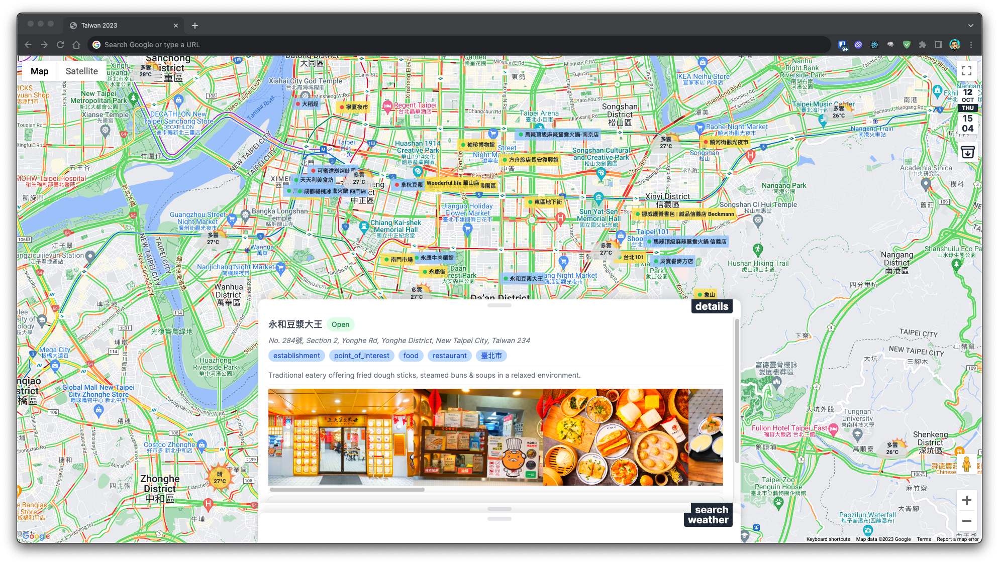
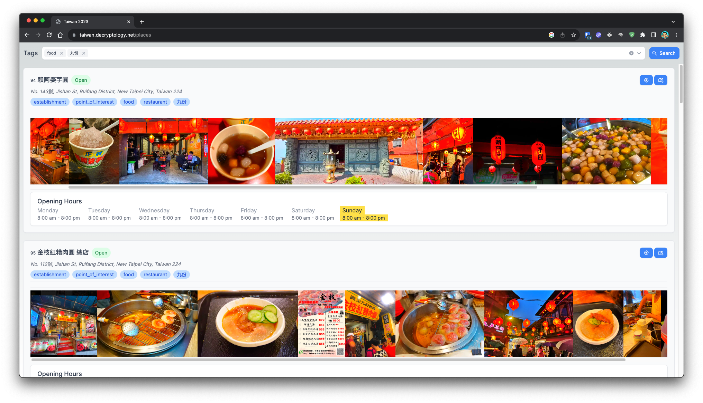
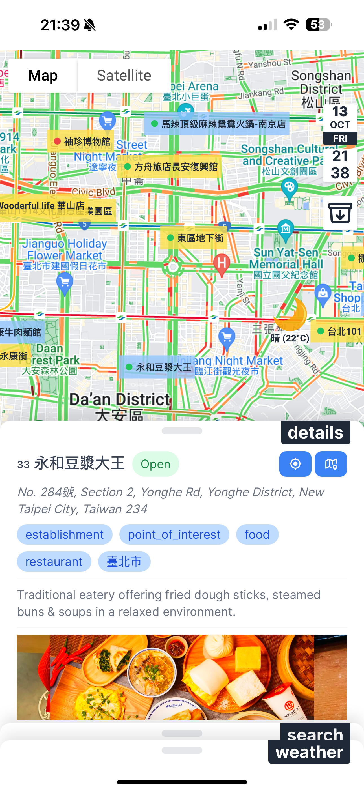

[](https://sonarqube.decryptology.net/dashboard?id=holiday-planner)
[](https://sonarqube.decryptology.net/dashboard?id=holiday-planner)

### Taiwan Trip Planner
A web application to show the curated places' information on a map.
Also shows the weather and traffic information

### Desktop
[](https://taiwan.decryptology.net)

[](https://taiwan.decryptology.net/places)

### Progressive Web Application


#### Getting Started
To run the development server, please run the following command.

```bash
npm run dev
```

Open [https://localhost:3001](http://localhost:3000) with your browser to see the app.

