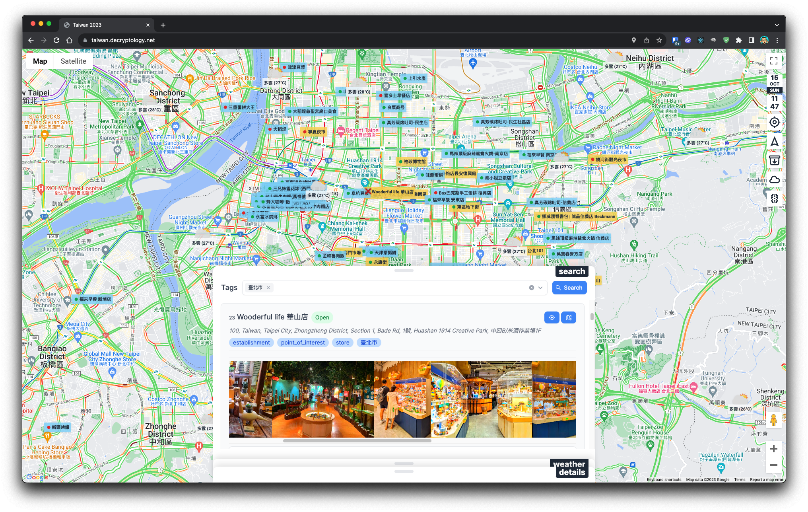

#### Getting Started
To run the development server, please run the following command.

```bash
npm run dev
```

Open [https://localhost:3001](http://localhost:3000) with your browser to see the app.

